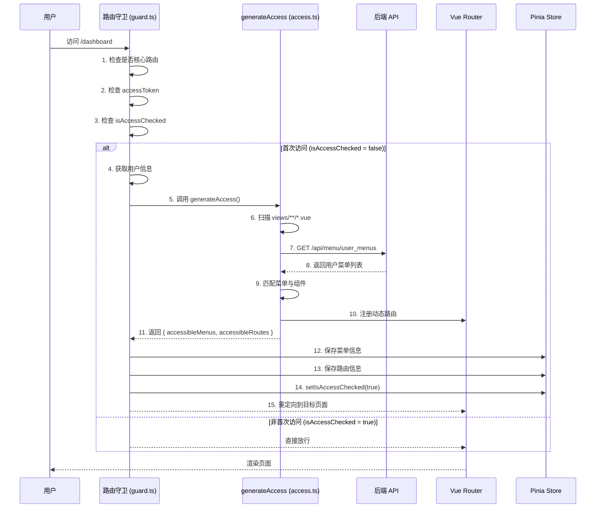

# 前端路由与菜单生成机制文档

## 概述

本文档详细说明 Vue Vben Admin 框架中 `generateAccess` 函数的执行流程，包括应用启动、路由守卫拦截、动态路由生成、菜单加载等核心机制。

---

## 一、应用启动阶段

### 1.1 启动入口

文件位置：[bootstrap.ts](file:///d:/Goroot/webgos/frontend/apps/web-admin/src/bootstrap.ts#L19-L79)

```typescript
async function bootstrap(namespace: string) {
  // 1. 初始化组件适配器
  await initComponentAdapter();

  // 2. 初始化表单组件
  await initSetupVbenForm();

  // 3. 创建 Vue 应用实例
  const app = createApp(App);

  // 4. 注册 v-loading 和 v-spinning 指令
  registerLoadingDirective(app, {
    loading: 'loading',
    spinning: 'spinning',
  });

  // 5. 初始化国际化
  await setupI18n(app);

  // 6. 配置 Pinia 状态管理
  await initStores(app, { namespace });

  // 7. 注册权限指令
  registerAccessDirective(app);

  // 8. 初始化 tippy 提示
  const { initTippy } = await import('@vben/common-ui/es/tippy');
  initTippy(app);

  // 9. 注册路由（此时只有核心路由）
  app.use(router);

  // 10. 配置 Vue Query
  const { VueQueryPlugin } = await import('@tanstack/vue-query');
  app.use(VueQueryPlugin);

  // 11. 配置 Motion 动画插件
  const { MotionPlugin } = await import('@vben/plugins/motion');
  app.use(MotionPlugin);

  // 12. 动态更新标题
  watchEffect(() => {
    if (preferences.app.dynamicTitle) {
      const routeTitle = router.currentRoute.value.meta?.title;
      const pageTitle =
        (routeTitle ? `${$t(routeTitle)} - ` : '') + preferences.app.name;
      useTitle(pageTitle);
    }
  });

  // 13. 挂载应用
  app.mount('#app');
}
```

### 1.2 启动时路由状态

应用启动时，**只有核心路由**，没有业务路由：

| 路由类型 | 说明 | 示例 |
|----------|------|------|
| 核心路由 | 必须存在，无需权限验证 | 登录页、404页、根路由 |
| 动态路由 | 需要权限验证 | 仪表盘、系统管理等业务页面 |

**核心路由定义位置：** [core.ts](file:///d:/Goroot/webgos/frontend/apps/web-admin/src/router/routes/core.ts#L24-L95)

```typescript
const coreRoutes: RouteRecordRaw[] = [
  {
    component: BasicLayout,
    name: 'Root',
    path: '/',
    redirect: preferences.app.defaultHomePath,
    children: [],  // 子路由后续动态添加
  },
  {
    component: AuthPageLayout,
    name: 'Authentication',
    path: '/auth',
    children: [
      { name: 'Login', path: 'login', ... },
      { name: 'CodeLogin', path: 'code-login', ... },
      // ... 其他认证页面
    ],
  },
];
```

---

## 二、路由守卫机制

### 2.1 守卫配置

文件位置：[guard.ts](file:///d:/Goroot/webgos/frontend/apps/web-admin/src/router/guard.ts#L122-L131)

```typescript
function createRouterGuard(router: Router) {
  /** 通用守卫 */
  setupCommonGuard(router);
  /** 权限访问守卫 */
  setupAccessGuard(router);
}
```

### 2.2 通用守卫

[guard.ts#L16-L41](file:///d:/Goroot/webgos/frontend/apps/web-admin/src/router/guard.ts#L16-L41)

```typescript
function setupCommonGuard(router: Router) {
  const loadedPaths = new Set<string>();

  router.beforeEach((to) => {
    // 记录页面是否已加载
    to.meta.loaded = loadedPaths.has(to.path);

    // 页面加载进度条
    if (!to.meta.loaded && preferences.transition.progress) {
      startProgress();
    }
    return true;
  });

  router.afterEach((to) => {
    loadedPaths.add(to.path);
    if (preferences.transition.progress) {
      stopProgress();
    }
  });
}
```

### 2.3 权限访问守卫（核心）

[guard.ts#L47-L119](file:///d:/Goroot/webgos/frontend/apps/web-admin/src/router/guard.ts#L47-L119)

```typescript
function setupAccessGuard(router: Router) {
  router.beforeEach(async (to, from) => {
    const accessStore = useAccessStore();
    const userStore = useUserStore();
    const authStore = useAuthStore();

    // 1. 核心路由检查（无需权限验证）
    if (coreRouteNames.includes(to.name as string)) {
      if (to.path === LOGIN_PATH && accessStore.accessToken) {
        // 已登录用户访问登录页，重定向到首页
        return decodeURIComponent(
          (to.query?.redirect as string) ||
            userStore.userInfo?.homePath ||
            preferences.app.defaultHomePath,
        );
      }
      return true;
    }

    // 2. Token 检查
    if (!accessStore.accessToken) {
      if (to.meta.ignoreAccess) {
        return true;  // 明确声明忽略权限验证
      }
      // 跳转登录页
      if (to.fullPath !== LOGIN_PATH) {
        return {
          path: LOGIN_PATH,
          query: { redirect: encodeURIComponent(to.fullPath) },
          replace: true,
        };
      }
      return to;
    }

    // 3. 动态路由是否已生成
    if (accessStore.isAccessChecked) {
      return true;  // 已生成，直接放行
    }

    // 4. 生成动态路由和菜单
    const userInfo = userStore.userInfo || (await authStore.fetchUserInfo());
    const userRoles = userInfo.roles ?? [];

    const { accessibleMenus, accessibleRoutes } = await generateAccess({
      roles: userRoles,
      router,
      routes: accessRoutes,
    });

    // 5. 保存生成的结果
    accessStore.setAccessMenus(accessibleMenus);
    accessStore.setAccessRoutes(accessibleRoutes);
    accessStore.setIsAccessChecked(true);

    // 6. 重定向到目标页面
    let redirectPath: string;
    if (from.query.redirect) {
      redirectPath = from.query.redirect as string;
    } else if (to.path === preferences.app.defaultHomePath) {
      redirectPath = preferences.app.defaultHomePath;
    } else if (userInfo.homePath && to.path === userInfo.homePath) {
      redirectPath = userInfo.homePath;
    } else {
      redirectPath = to.fullPath;
    }

    return {
      ...router.resolve(decodeURIComponent(redirectPath)),
      replace: true,
    };
  });
}
```

---

## 三、generateAccess 执行流程

### 3.1 函数定义

文件位置：[access.ts](file:///d:/Goroot/webgos/frontend/apps/web-admin/src/router/access.ts#L17-L40)

```typescript
async function generateAccess(options: GenerateMenuAndRoutesOptions) {
  // 1. 扫描 views 目录下所有 .vue 组件
  const pageMap: ComponentRecordType = import.meta.glob('../views/**/*.vue');

  // 2. 定义布局组件映射
  const layoutMap: ComponentRecordType = {
    BasicLayout,   // 基础布局（侧边栏 + 顶部导航）
    IFrameView,    // 内嵌页面布局
  };

  // 3. 调用框架的 generateAccessible 函数
  return await generateAccessible(preferences.app.accessMode, {
    ...options,

    // 异步获取菜单列表
    fetchMenuListAsync: async () => {
      message.loading({
        content: `${$t('common.loadingMenu')}...`,
        duration: 1.5,
      });
      return await getAllMenusApi();  // GET /api/menu/user_menus
    },

    // 无权限时跳转的 403 页面
    forbiddenComponent,

    // 布局组件映射
    layoutMap,
    pageMap,
  });
}
```

### 3.2 菜单 API 请求

文件位置：[menu.ts](file:///d:/Goroot/webgos/frontend/apps/web-admin/src/api/core/menu.ts#L8-L11)

```typescript
export async function getAllMenusApi() {
  return requestClient.get<RouteRecordStringComponent[]>(
    '/api/menu/user_menus',
  );
}
```

**后端返回数据格式示例：**

```json
[
  {
    "name": "Dashboard",
    "path": "/dashboard",
    "component": "/dashboard/analytics/index",
    "meta": {
      "title": "仪表盘",
      "icon": "lucide:layout-dashboard",
      "order": 1
    },
    "children": [
      {
        "name": "Analytics",
        "path": "/dashboard/analytics",
        "component": "/dashboard/analytics/index",
        "meta": {
          "title": "分析页",
          "icon": "lucide:bar-chart"
        }
      }
    ]
  }
]
```

---

## 四、完整时序图



---

## 五、关键数据流

### 5.1 数据流转表

| 阶段 | 输入 | 处理 | 输出 |
|------|------|------|------|
| 1. 获取用户信息 | accessToken | 调用用户信息 API | userInfo + roles |
| 2. 获取菜单 | - | GET /api/menu/user_menus | 菜单树（JSON） |
| 3. 扫描组件 | - | import.meta.glob | pageMap（组件映射） |
| 4. 生成路由 | 菜单树 + pageMap | 匹配 path 与组件 | accessibleRoutes |
| 5. 生成菜单 | 菜单树 | 过滤无权限节点 | accessibleMenus |
| 6. 注册路由 | accessibleRoutes | router.addRoute() | 路由表更新 |
| 7. 保存状态 | menus + routes | Store 持久化 | 页面可访问 |

### 5.2 核心 Store 状态

```typescript
// useAccessStore 存储的状态
{
  accessToken: string,           // 访问令牌
  accessMenus: MenuRecord[],     // 可访问的菜单列表
  accessRoutes: RouteRecord[],   // 可访问的路由列表
  isAccessChecked: boolean,      // 是否已生成动态路由
  loginExpired: boolean,         // 登录是否过期
}
```

---

## 六、权限模式说明

### 6.1 前端权限模式（frontend）

```typescript
preferences.app.accessMode = 'frontend';
```

- 路由和菜单由**前端定义的路由表**生成
- 根据用户 `roles` 过滤可访问的路由
- 适合角色固定、权限规则简单的场景

### 6.2 后端权限模式（backend）← 常用

```typescript
preferences.app.accessMode = 'backend';
```

- 路由和菜单由**后端 API 返回**
- 调用 `fetchMenuListAsync()` 获取菜单数据
- 适合角色动态、权限规则复杂的场景

### 6.3 混合模式（mixed）

- 部分路由由前端定义，部分由后端返回
- 适合需要灵活控制的场景

---

## 七、动态路由加载机制

### 7.1 路由文件组织

```
src/router/routes/
├── core.ts              # 核心路由（登录、404等）
├── index.ts             # 路由导出入口
└── modules/             # 动态路由模块
    ├── dashboard.ts     # 仪表盘路由
    ├── system.ts        # 系统管理路由
    └── vben.ts          # Vben 示例路由
```

### 7.2 自动加载路由

[routes/index.ts](file:///d:/Goroot/webgos/frontend/apps/web-admin/src/router/routes/index.ts#L7-L16)

```typescript
// 自动加载 modules 目录下的所有 .ts 文件
const dynamicRouteFiles = import.meta.glob('./modules/**/*.ts', {
  eager: true,  // 立即加载（非懒加载）
});

// 合并路由模块
const dynamicRoutes: RouteRecordRaw[] = mergeRouteModules(dynamicRouteFiles);

// 有权限校验的路由列表
const accessRoutes = [...dynamicRoutes, ...staticRoutes];
```

### 7.3 组件自动扫描

```typescript
// 扫描 views 目录下所有 .vue 文件（排除 modules 目录）
const componentKeys: string[] = Object.keys(
  import.meta.glob('../../views/**/*.vue'),
)
  .filter((item) => !item.includes('/modules/'))
  .map((v) => {
    const path = v.replace('../../views/', '/');
    return path.endsWith('.vue') ? path.slice(0, -4) : path;
  });
```

---

## 八、常见问题

### 8.1 为什么首次访问业务页面会慢？

**原因：** 首次访问时需要：
1. 调用后端 API 获取菜单数据
2. 扫描并匹配组件
3. 注册动态路由
4. 重定向到目标页面

**优化建议：**
- 在登录成功后预加载菜单数据
- 缓存菜单数据，减少重复请求

### 8.2 如何添加新菜单？

**步骤：**

1. 在 `src/router/routes/modules/` 创建路由文件
2. 在 `src/views/` 创建对应的页面组件
3. 在后端添加对应的菜单数据

### 8.3 如何调试菜单加载问题？

```typescript
// 在 guard.ts 中添加日志
console.log('用户角色:', userRoles);
console.log('后端返回菜单:', await getAllMenusApi());
console.log('生成的路由:', accessibleRoutes);
console.log('生成的菜单:', accessibleMenus);
```

---

## 九、关键文件索引

| 文件 | 作用 | 行号 |
|------|------|------|
| [bootstrap.ts](file:///d:/Goroot/webgos/frontend/apps/web-admin/src/bootstrap.ts) | 应用启动入口 | 19-79 |
| [guard.ts](file:///d:/Goroot/webgos/frontend/apps/web-admin/src/router/guard.ts) | 路由守卫配置 | 47-119 |
| [access.ts](file:///d:/Goroot/webgos/frontend/apps/web-admin/src/router/access.ts) | 路由和菜单生成 | 17-40 |
| [menu.ts](file:///d:/Goroot/webgos/frontend/apps/web-admin/src/api/core/menu.ts) | 菜单 API | 8-11 |
| [routes/index.ts](file:///d:/Goroot/webgos/frontend/apps/web-admin/src/router/routes/index.ts) | 动态路由加载 | 7-37 |
| [routes/core.ts](file:///d:/Goroot/webgos/frontend/apps/web-admin/src/router/routes/core.ts) | 核心路由定义 | 24-95 |
| [basic.vue](file:///d:/Goroot/webgos/frontend/apps/web-admin/src/layouts/basic.vue) | 布局组件 | 142-154 |

---

## 十、总结

### 10.1 核心要点

1. **懒加载生成**：路由不是在应用启动时生成，而是在**首次访问业务页面时**生成
2. **后端驱动**：菜单数据来自后端 `/api/menu/user_menus` 接口
3. **组件映射**：通过 `import.meta.glob` 自动扫描 `views` 目录，将菜单 path 映射到组件
4. **一次性执行**：`isAccessChecked` 确保只生成一次，后续访问直接放行
5. **权限控制**：无权限的菜单不会出现在侧边栏，访问会被重定向到 403 页面

### 10.2 执行流程总结

```
应用启动 → 注册核心路由 → 用户访问业务页面 → 路由守卫拦截
  → 检查 Token → 获取用户信息 → 调用 generateAccess
  → 获取后端菜单 → 匹配组件 → 注册动态路由
  → 保存状态 → 重定向到目标页面 → 渲染完成
```